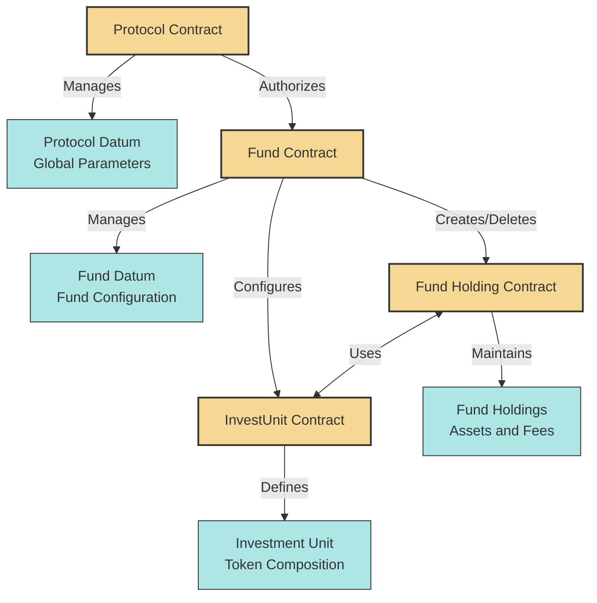
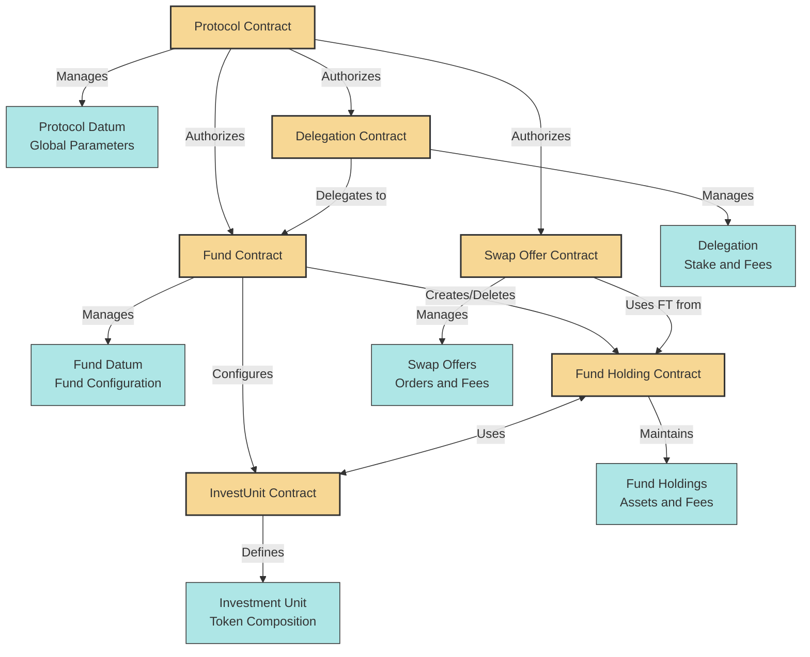
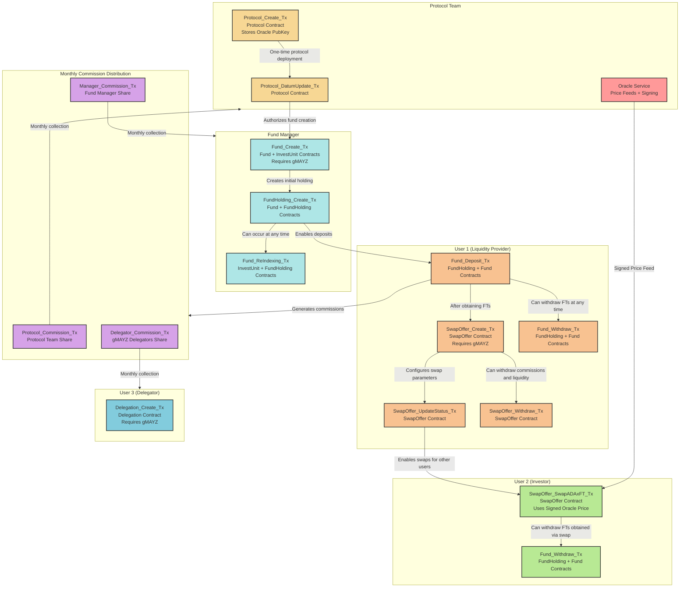
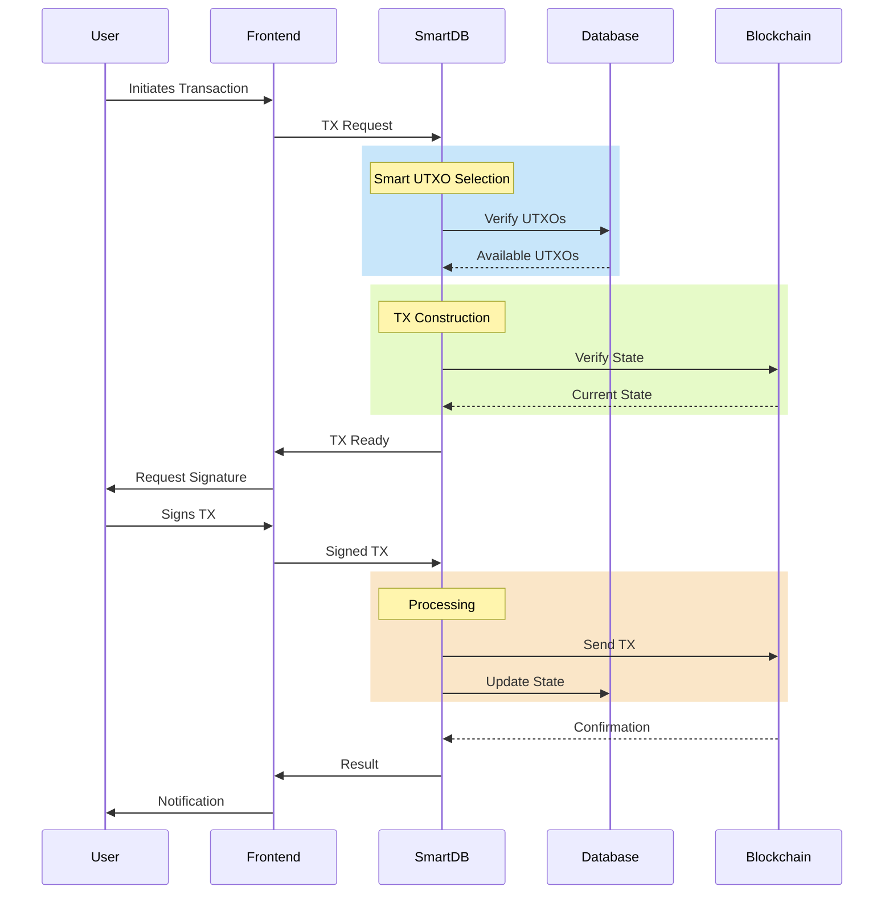

# MAYZ Protocol: Smart Contracts

## Table of Contents
- [MAYZ Protocol: Smart Contracts](#mayz-protocol-smart-contracts)
  - [Table of Contents](#table-of-contents)
  - [Introduction](#introduction)
  - [Current Status](#current-status)
    - [Testnet Release](#testnet-release)
    - [Upcoming Mainnet Release](#upcoming-mainnet-release)
  - [Key Features](#key-features)
  - [Architecture Overview](#architecture-overview)
  - [Smart Contracts](#smart-contracts)
    - [Basic Protocol Structure](#basic-protocol-structure)
    - [Extended Protocol Structure](#extended-protocol-structure)
    - [Transactions Overview](#transactions-overview)
    - [Transactions Flow](#transactions-flow)
  - [Key Concepts](#key-concepts)
  - [Repository Structure](#repository-structure)
  - [Development Environment](#development-environment)
  - [Using the Dev Container](#using-the-dev-container)
  - [Testing](#testing)
  - [Deployment](#deployment)
  - [Security Considerations](#security-considerations)
  - [Token Economics](#token-economics)
  - [Oracle Integration](#oracle-integration)
  - [Development Roadmap](#development-roadmap)
  - [Community and Support](#community-and-support)
  - [Additional Documentation](#additional-documentation)
  - [Contributing](#contributing)

## Introduction
Welcome to the MAYZ Protocol Smart Contracts Repository. This repository contains the core smart contracts that power the MAYZ Protocol, a decentralized finance (DeFi) ecosystem built on the Cardano blockchain. Our contracts are written in Plutus, Cardano's native smart contract language, aiming to democratize finance by providing a permissionless platform for creating and managing investment funds, facilitating liquidity, and empowering users through innovative mechanisms.

> For implementation details and technical deep-dives, please refer to our [Technical Documentation](./docs/TECHNICAL.md).  
> For a complete overview of the protocol's smart contracts, datums, redeemers, and their interactions, see the [Smart Contracts](./docs/SMART-CONTRACTS.md) documentation.

## Current Status

### Testnet Release
We are excited to announce that the MAYZ Protocol is currently live on the Cardano testnet. You can interact with our decentralized application (dApp) at https://testnet.mayz.io/. This testnet release allows users to explore the protocol's features, create and manage funds, and participate in swap offers in a risk-free environment.

### Upcoming Mainnet Release
We are preparing for our mainnet release, which will make the MAYZ Protocol fully operational on the Cardano main network. Stay tuned for the official announcement and launch date.

We encourage community members to join our Discord server for the latest updates on the mainnet release and to participate in final testing and feedback rounds.

## Key Features
- **Decentralized Investment Funds**: Create, manage, and participate in investment funds composed of Cardano native tokens.
- **Dynamic Fund Tokens (FTs)**: Represent fund shares with real-time valuation based on underlying assets.
- **Swap Offers**: Exchange ADA for Fund Tokens and vice versa through a decentralized marketplace.
- **Oracle-Powered Pricing**: Accurate and up-to-date asset valuations through a robust oracle system.
- **Flexible Re-indexing**: Adapt fund compositions to market conditions while maintaining transparency.
- **Multi-UTXO Fund Holdings**: Optimize concurrency and scalability through innovative fund structure design.
- **Delegation System**: Allow MAYZ token holders to delegate their tokens to funds and earn commissions.

> For detailed technical implementation of these features, see our [Technical Documentation](./docs/TECHNICAL.md#key-features).

## Architecture Overview
The MAYZ Protocol is built on a modular architecture, leveraging Cardano's extended UTXO model. Our system comprises interconnected components:
- **Fund Factory**: Facilitates decentralized investment fund creation and management.
- **Swap Offer Engine**: Enables liquidity provision and token exchanges.
- **Oracle Service**: Provides real-time price data for asset valuation.
- **Re-indexing Mechanism**: Allows dynamic fund composition adjustments.
- **Multi-UTXO Management**: Optimizes fund operations and user concurrency.
- **Delegation System**: Manages MAYZ token delegations and commission distributions.




> For in-depth technical details about our architecture and UTXO model implementation, see the [Technical Documentation](./docs/TECHNICAL.md#architecture-overview).

## Smart Contracts
Our protocol utilizes advanced smart contracts for secure and efficient operations:
- **Protocol Contract**: Manages global protocol parameters and upgrades.
- **Fund Contract**: Manages the creation, operation, and liquidation of funds.
- **Fund Holding Contract**: Handles individual fund holdings and optimizes concurrency.
- **Invest Unit Contract**: Manages representation and valuation of fund compositions.
- **SwapOffer Contract**: Facilitates ADA and Fund Token exchanges.
- **Delegation Contract**: Manages MAYZ token delegations to funds.
- **Script Contract**: Oversees deployed scripts on-chain.

### Basic Protocol Structure  


### Extended Protocol Structure



### Transactions Overview



### Transactions Flow



> For detailed information on each contract, refer to the [Smart Contracts](./docs/SMART-CONTRACTS.md) documentation.  
> For technical implementation details and internal mechanisms, see our [Technical Documentation](./docs/TECHNICAL.md#smart-contracts).

## Key Concepts
- **Investment Unit (IU)**: Defines token composition of each fund.
- **Fund Tokens (FTs)**: Represent shares in a fund, minted on deposit and burned on withdrawal.
- **Multi-UTXO Fund Holdings**: Improve concurrency and scalability with multiple UTXOs.
- **Re-indexing Process**: Adjusts fund composition while maintaining total fund value.
- **Commission System**: Paid upfront for the remaining fund lifetime, with partial refunds upon early withdrawal.
- **Delegation**: MAYZ token holders can delegate tokens to funds to earn a share of commissions.

> For in-depth explanations, see our Key Concepts Guide [TODO].  
> For technical implementation details of these concepts, refer to our [Technical Documentation](./docs/TECHNICAL.md#key-concepts).

## Repository Structure
```
mayz-protocol-contracts/
├── LICENSE
├── README.md
├── app/
│   ├── cli.hs
│   └── deploy.hs
├── docs/
│   └── Documentation files (.md)
├── export/
│   ├── test/
│       ├── various Plutus scripts (.plutus)
│       └── deploy.json
├── src/
│   ├── Generic/
│   │   ├── Various Helpers and Types (e.g., CLIHelpers, DeployHelpers, etc.)
│   └── Protocol/
│       ├── Contracts (BuyOrder, Delegation, Fund, etc.)
│       └── Helpers and Types
├── tests/
│   ├── TestUtils/
│   │   ├── ContextGenerators, Helpers, TxGenerators, etc.
│   ├── Contracts (InitialData, TxContext, TxSpecs)
│   └── TestTree (PropertyTests, UnitTests, etc.)
├── cabal.project
├── mayz-protocol.cabal
├── fourmolu.yaml
├── hie.yaml
└── misc config, workspace, and export files
```

## Development Environment
- **The Glorious Glasgow Haskell Compilation System**: version 8.10.7
- **Cabal library**: compiled using version 3.6.2.0

To set up the development environment:
1. Clone this repository
2. Run `cabal build` to compile the contracts

> For detailed technical setup requirements and development environment configuration, see our [Technical Documentation](./docs/TECHNICAL.md#development-environment).

## Using the Dev Container
For a consistent and ready-to-use development environment, follow these steps to set up the Dev Container:

1. **Open the Dev Container in VS Code**
   - Open the project in Visual Studio Code and use the **Dev Containers** extension to open the workspace in a Dev Container.
   - VS Code will automatically build the container as specified in `.devcontainer/docker-compose.yml` and `Dockerfile`.

2. **Configure for macOS Users**
   - If you're using a Mac, make sure to set the `BUILDARCH` argument to `"arm64"` in `.devcontainer/docker-compose.yml` to ensure compatibility with macOS architecture.
   - Example:
     ```
     services:
       plutus:
         build:
           context: ..
           dockerfile: .devcontainer/ubuntu_haskell/Dockerfile
           args:
             BUILDARCH: "arm64"
     ```

3. **Build the Contracts**
   - Once the container is running, update dependencies and build the project:
     ```
     cabal update
     cabal build all
     ```

   - **Note for macOS Users**: macOS handles Docker containers differently than Linux, and resource constraints can cause builds to fail or slow down. Running `cabal build all -j1` limits the build to a single worker, which can help prevent memory issues, especially on systems with limited resources or in macOS environments. 

## Testing

We employ a comprehensive testing strategy with four main test suites:

1. **Unit Tests**: Verify individual components and functions for correctness.
2. **Property-Based Tests**: Ensure system properties hold under various inputs.
3. **Performance Tests**: Evaluate resource usage and optimization.
4. **Automatic Tests**: Generate and run complex test scenarios automatically.

> For detailed information on our testing approach, test cases, and how to run tests, please refer to our [Testing](./docs/TESTING.md) documentation.  
> For technical details about test implementation and architecture, see our [Technical Documentation](./docs/TECHNICAL.md#testing).

Run all tests with:

```
cabal test
```

To run a specific test suite:
```
cabal test <suite-name>
```

Replace <suite-name> with UnitTests, PropertyBasedTests, PerformanceTests, or AutomaticTests.

## Deployment
> For detailed deployment instructions, refer to the Deployment Guide [TODO].  
> For technical deployment specifications and requirements, see our [Technical Documentation](./docs/TECHNICAL.md#deployment).

## Security Considerations
- **Rounding errors**: Commission calculations use high-precision arithmetic.
- **Oracle dependency**: Price manipulations are mitigated through multi-source oracles.
- **Multi-UTXO design**: Enhances concurrency and resists certain types of attacks.

We are committed to ongoing security audits. 

> For more information, see our Security Policy [TODO].  
> For technical security implementation details and considerations, refer to our [Technical Documentation](./docs/TECHNICAL.md#security).

## Token Economics
The $MAYZ token serves multiple crucial functions:
- **Fund Creation**: Lock $MAYZ to create and manage funds.
- **Liquidity Provision**: Stake $MAYZ to create Swap Offers and earn commissions.
- **Delegation**: Delegate $MAYZ to funds to earn a share of commissions.
- **Incentivization**: Reward active participants and align community interests.

> For more information, see the [Token Economics](https://mayz.gitbook.io/mayz-whitepaper-v2/introduction/tokenomics) documentation.  
> For technical implementation details of token mechanics, see our [Technical Documentation](./docs/TECHNICAL.md#token-economics).

## Oracle Integration
Our oracle system:
- Aggregates price data from multiple sources
- Implements error detection and correction mechanisms
- Provides real-time updates for fair valuations and swaps
- Integrates with smart contracts for on-chain price verification

> For more information, refer to the Oracle documentation [TODO].  
> For technical implementation details of our oracle system, see our [Technical Documentation](./docs/TECHNICAL.md#oracle-integration).

## Development Roadmap

For our full development roadmap, visit the [Project Roadmap](https://mayz.gitbook.io/mayz-whitepaper-v2/mayz/development-roadmap).

## Community and Support

Join our vibrant community and stay updated:
- [MAYZ Website](https://mayz.io/)
- [MAYZ X](https://twitter.com/MAYZProtocol)
- [MAYZ Medium](https://medium.com/@MAYZprotocol)
- [MAYZ Discord](https://discord.com/invite/6xkbynuNrj)
- [MAYZ GitHub](https://github.com/MAYZGitHub/)

> For technical support, open a ticket in our GitHub repository or reach out on [Discord](https://discord.com/invite/6xkbynuNrj).

## Additional Documentation
- **Whitepaper Documentation**: Detailed information about MAYZ Protocol. [Whitepaper v2](https://mayz.gitbook.io/mayz-whitepaper-v2)
- **Technical Documentation**: In-depth technical details and implementation specifics. [Link](./docs/TECHNICAL.md).
- **Smart Contracts Documentation**: Comprehensive guide to all contracts, datums, and redeemers. [Link](./docs/SMART-CONTRACTS.md).
- **Re-indexing Basics**: Overview of the fund re-indexing process. [Link](./docs/REINDEXING-BASICS.md).
- **Re-indexing Deep Dive**: Detailed explanation of re-indexing methodology. [Link](./docs/REINDEXING-DEEP.md).
- **Testing Documentation**: Detailed information on our testing approach. [Link](./docs/TESTING.md).
- **Project Roadmap**: Future development plans for MAYZ Protocol. [Link](https://mayz.gitbook.io/mayz-whitepaper-v2/mayz/development-roadmap).
- **Token Economics Documentation**: Detailed breakdown of the MAYZ token ecosystem. [Link](https://mayz.gitbook.io/mayz-whitepaper-v2/introduction/tokenomics).
- **Key Concepts Guide**: In-depth explanations of core protocol concepts. [TODO].
- **Deployment Guide**: Instructions for deploying MAYZ Protocol. [TODO].
- **Oracle Documentation**: Information on our oracle implementation. [TODO].
- **Contributing Guidelines**: See our Contributing Guidelines. [TODO].

> For more documentation, refer to the `docs/` directory. For technical implementation details of any aspect of the protocol, see our [Technical Documentation](./docs/TECHNICAL.md).  
> If you have any questions, feel free to open an issue or reach out on [Discord](https://discord.com/invite/6xkbynuNrj.

## Contributing

See our Contributing Guidelines [TODO] for more information.  
> For technical contribution requirements and guidelines, refer to our [Technical Documentation](./docs/TECHNICAL.md#contributing).